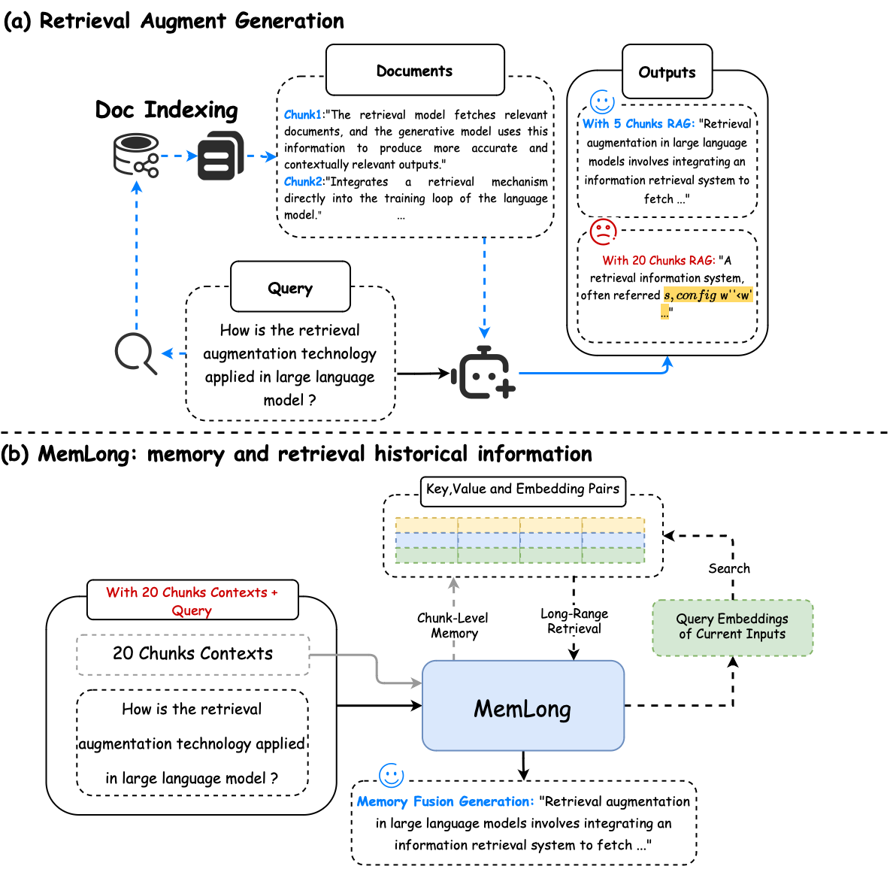

# MemLong:MemLong: Memory-Augmented Retrieval for Long Text Modeling

# What is MemLong?
MemLong is a method that utilizes explicit retrievers to extend the context length of language models. It is compatible with any current Decoder-Only architecture model and requires only a small amount of fine-tuning data to achieve ultra-long length extension. Here are some key points of our work:  
**Chunking**: For sequences of arbitrary length, we chunk them into fixed lengths (in our experiments, we used lengths of 256 and 512).
Memory and Retrieval: For the retrieval method, we innovatively proposed using an external retriever to search for the current chunk. The benefit of this approach is that it leverages the powerful retrieval capabilities of current models like Bge-m3. For memory, we introduced dynamic memory planning. Specifically, our strategy differs from conventional FIFO (First In, First Out) by using a counter to calculate the trigger frequency of each chunk. When the memory length is exceeded, we prioritize deleting chunks with lower trigger frequencies until the required number of deletions is met.   
**Positional Encoding and Memory Fusion**: Our experiments found that if we reassign positional information for retrieved chunks and the current chunk, such as rearranging the original positional information from $c_k=(n_1,n_2,...,n_k)$ to $(r_1,r_2,...,r_n,c_k)$, it can lead to catastrophic information collapse. Therefore, we simply set the positional information of retrieved chunks to 0. Improving positional encoding will be addressed in future work. At the model's upper layer, we modified the attention mechanism so that the current query can access the retrieved chunks.   
**Efficient Training**: During the fine-tuning phase, we only fine-tune the layers above the memory layer of the model. The advantage of this approach is that it significantly reduces the number of parameters to be fine-tuned compared to full fine-tuning, saving a lot of GPU memory. This is also why we only need a small amount of data.   
If you are interested in the specific details, you can refer to the paper [Here](https://arxiv.org/pdf/2408.16967).
# Quick Start
## Training Implemention

# The illustration is comming soon.
[ ] quick start and overview illustration
[ ] pip requirements
[ ] Data Collection and Pre-processing   
[ ] Stage1 Training methods and scripts  
[ ] Stage2 Training methods and scripts  
[ ] Instruction Tuning
[ ] Eval methods and scripts  
[ ] Language modeling evaluation   

